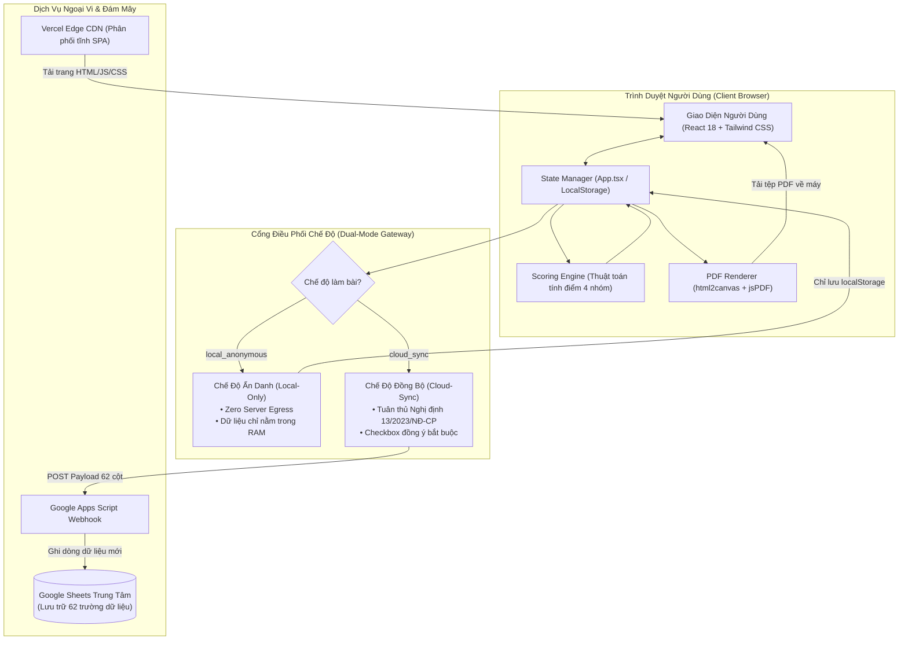
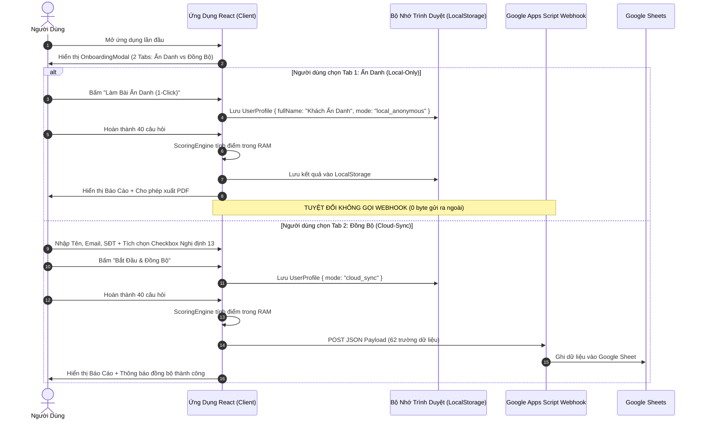
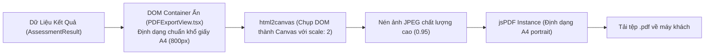

# KIẾN TRÚC HỆ THỐNG & LUỒNG DỮ LIỆU (SYSTEM ARCHITECTURE)

- **Dự án**: Khảo Sát Tính Cách Theo Social Styles
- **Mô hình kiến trúc**: Single Page Application (SPA) • Client-Side Processing • Serverless Cloud Integration
- **Cập nhật ngày**: 16/09/2026

---

## 1. Sơ Đồ Kiến Trúc Tổng Thể (System Architecture Diagram)

---

## 2. Chi Tiết Kiến Trúc Dual-Mode (Bảo Vệ Quyền Riêng Tư)

Hệ thống được thiết kế theo nguyên lý **Privacy-by-Design**, trao toàn quyền quyết định về mặt dữ liệu cho người dùng:

---

## 3. Luồng Kết Xuất Báo Cáo PDF Tại Client (Client-Side PDF Pipeline)

Để đảm bảo hiệu năng tối đa và tính bảo mật (không gửi thông tin cá nhân lên máy chủ để tạo file PDF), toàn bộ quá trình xuất PDF diễn ra 100% tại máy khách:

---

## 4. Định Tuyến Trạng Thái Theo Hash (Hash-based Routing)

Ứng dụng sử dụng cơ chế định tuyến dựa trên URL Hash để đảm bảo tính gọn nhẹ của Single Page Application và tương thích hoàn hảo với CDN Vercel mà không yêu cầu cấu hình server rewrite phức tạp:

| URL Hash | View Component | Mục Đích Sử Dụng |
| :--- | :--- | :--- |
| `/#` hoặc trống | `App.tsx` (Survey View) | Trải nghiệm làm bài khảo sát và xem báo cáo kết quả. |
| `/#research` | `ResearchPage.tsx` | Đọc toàn bộ tài liệu nghiên cứu học thuật, lịch sử 2.400 năm và tải PDF nghiên cứu. |
| `/#roadmap` | `RoadmapPage.tsx` | Xem 5 trụ cột mở rộng hệ thống và lộ trình phát triển. |

---

## 5. Ranh Giới An Toàn & Bảo Mật Dữ Liệu (Security Boundaries)

1. **Zero Secret Client**: Mã nguồn React không chứa bất kỳ secret key, token quản trị hay mật khẩu nào. URL Webhook của Google Apps Script là endpoint công khai được bảo vệ theo cơ chế hạn chế ghi (Append-only).
2. **Không Rò Rỉ PII**: Trong chế độ Ẩn danh, không có bất kỳ lệnh gọi mạng nào (No fetch, No analytics tracking PII, No third-party pixels).
3. **Phòng Ngừa Tấn Công XSS**: Toàn bộ dữ liệu hiển thị trên giao diện đều được React tự động escape, ngăn chặn hoàn toàn việc chèn mã độc HTML/Script.
